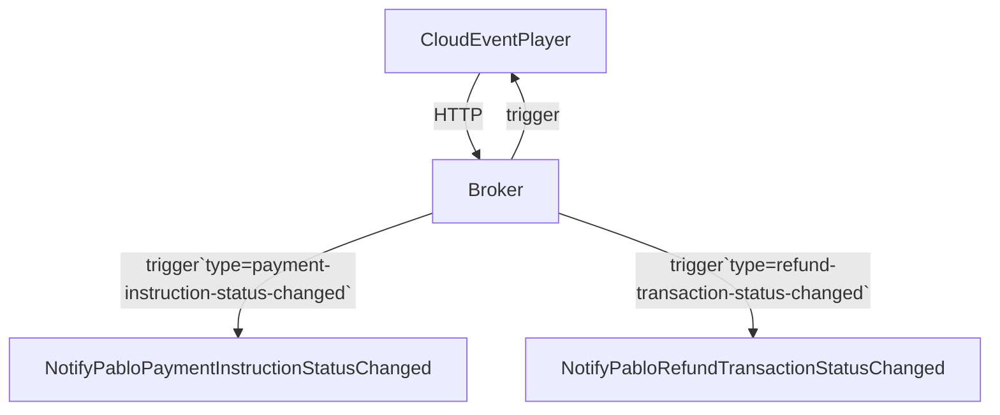

# Run Application
## Installation
* Install Docker `brew install docker`
* Install kind `brew install kind`
* Install kubectl `brew install kubectl`
* Install kn `brew install knative/client/kn`
* Install kn quickstart plugin `brew install knative-sandbox/kn-plugins/quickstart`

### Run Knative
* $ kn quickstart kind
 
### Run Apps
* $ kubectl apply -f .kn

### Delete Apps
* $ kubectl delete -f .kn

### Delete Knative Cluster
* $ kind delete clusters knative

# Diagram
`Install mermaid plugin to IDEA to be able to see the diagram`
